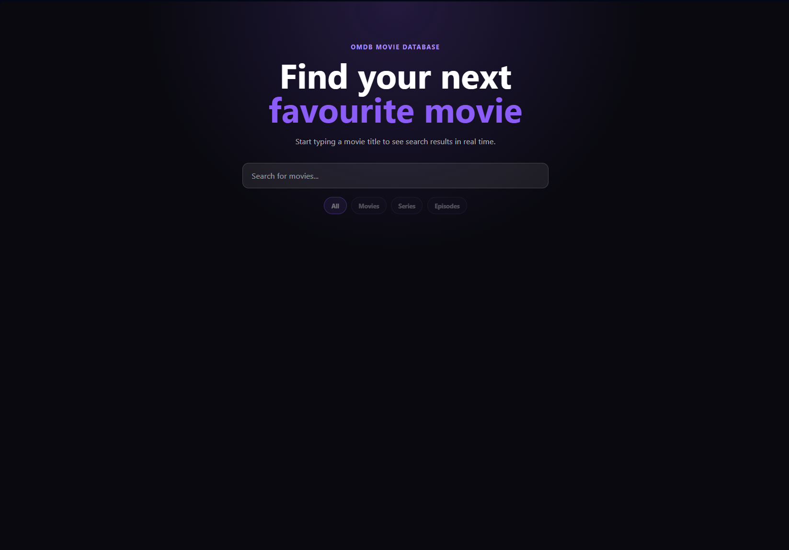
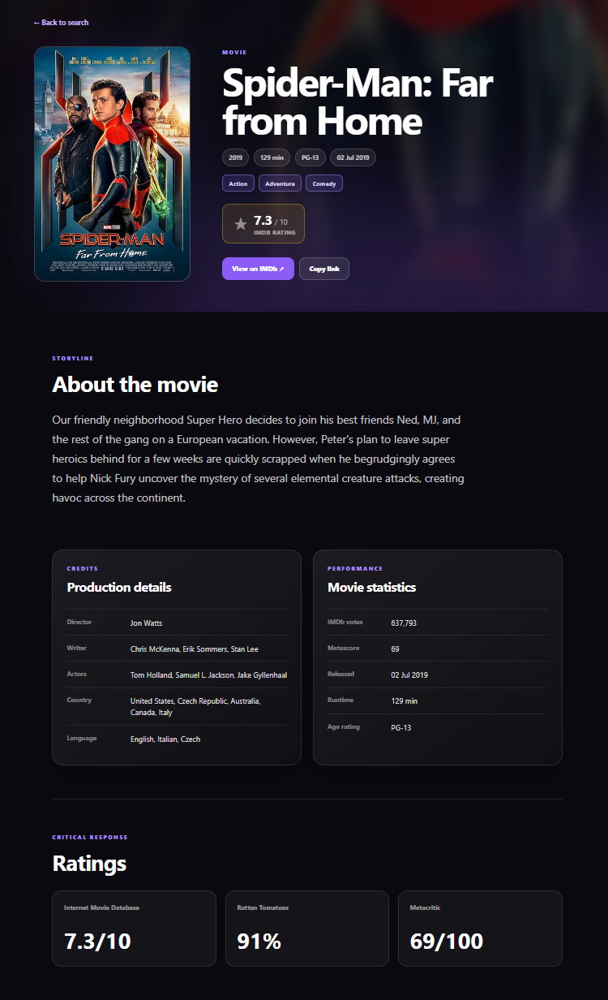
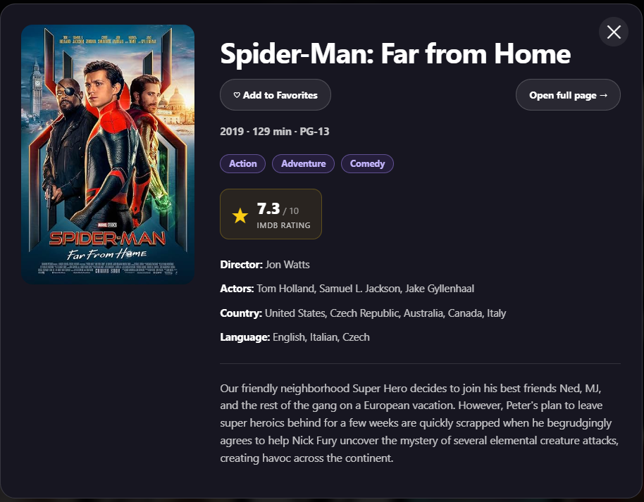

# 🎬 Movie Search App

A modern React application for searching movies using the **OMDb API**.

The project demonstrates building a production-style React application with custom hooks, routing, API integration, request cancellation, persistent storage, animations, and automated testing.

> 🔗 **Live Demo:** https://search-movie-react-app.vercel.app

---

## ✨ Features

- 🔍 Live movie search
- ⏳ Debounced search requests
- 🚫 Request cancellation with AbortController
- 📄 Detailed movie page
- 🎥 Movie details modal
- ❤️ Favorites with LocalStorage
- 🕘 Search history
- 📑 Pagination
- 🎭 Filter by movie type
- 💀 Skeleton loading state
- ❌ Error handling
- 🧭 React Router navigation
- 🔗 URL synchronization
- 📱 Responsive layout
- 🧪 Unit testing with Vitest & React Testing Library

---

## 📸 Screenshots

### Home Page

> Add screenshot here



---

### Movie Details

> Add screenshot here




---

## 🛠 Tech Stack

### Frontend

- React
- React Router
- JavaScript (ES6+)
- CSS3
- Framer Motion

### API

- OMDb API

### Testing

- Vitest
- React Testing Library
- JSDOM

---

## 📂 Project Structure

```text
src/
│
├── assets/
├── components/
│   ├── FavoriteCard/
│   ├── Favorites/
│   ├── MovieCard/
│   ├── MovieList/
│   ├── MovieModal/
│   ├── Pagination/
│   ├── SearchBar/
│   ├── SearchHistory/
│   ├── SkeletonCard/
│   ├── SkeletonList/
│   └── TypeFilter/
│
├── hooks/
│   ├── useDebounce.js
│   └── useLocalStorage.js
│
├── pages/
│   ├── HomePage/
│   ├── MovieDetailsPage/
│   └── NotFoundPage/
│
└── services/
    └── api.js
```

---

## 🚀 Getting Started

Clone the repository

```bash
git clone https://github.com/mmf2003/search-movie-react-app.git
```

Go to the project

```bash
cd search-movie-react-app
```

Install dependencies

```bash
npm install
```

Create a `.env` file

```env
VITE_OMDB_API_KEY=your_api_key
```

Start development server

```bash
npm run dev
```

---

## 🧪 Running Tests

Run all tests

```bash
npm run test
```

Run tests once

```bash
npm run test:run
```

Generate coverage report

```bash
npm run test:coverage
```

---

## 📊 Test Coverage

The project includes unit tests for:

- Custom Hooks
- API Services
- Pagination
- SearchBar
- TypeFilter
- MovieCard

Testing tools:

- Vitest
- React Testing Library

---

## 🌐 API

The project uses the free OMDb API.

https://www.omdbapi.com/

---

## 🔮 Future Improvements

- Dark / Light theme
- Sorting movies
- Infinite scrolling
- Advanced filters
- PWA support
- Internationalization (i18n)

---

## 👨‍💻 Author

Oleksandr

GitHub:

https://github.com/mmf2003/Search_movie_React_app.git
